<div align="center">

# 🔬 PathoAI

### *Intelligent Histopathology Analysis Powered by Deep Learning*

[](https://www.gnu.org/licenses/agpl-3.0)
[](https://www.python.org/downloads/)
[](https://www.tensorflow.org/)
[](https://streamlit.io/)
[]()

*Transforming histopathology diagnosis with AI-powered tissue classification and cell segmentation*

[🚀 Quick Start](#-quick-start) • [📖 Documentation](docs/index.md) • [🎯 Features](#-features) • [🤝 Contributing](#-contributing)

---

</div>

## 🌟 Overview

**PathoAI** is a state-of-the-art histopathology image analysis system that combines cutting-edge deep learning models with an intuitive web interface. Designed to assist pathologists in diagnosing lung tissue samples, PathoAI provides automated classification, cell segmentation, and comprehensive morphometric analysis—all with visual explanations and confidence metrics.

### 🎯 What PathoAI Does

```mermaid
graph LR
    A[🖼️ Upload Image] --> B[🔍 AI Analysis]
    B --> C[📊 Classification]
    B --> D[🧬 Segmentation]
    C --> E[📈 Results + Heatmap]
    D --> F[📐 Morphometrics]
    E --> G[📄 PDF Report]
    F --> G
```



## ✨ Features

### 🧠 **Intelligent Classification**
- **EfficientNetV2-S Architecture**: State-of-the-art tissue classification
- **Three-Class Detection**: Benign, Adenocarcinoma, Squamous Cell Carcinoma
- **Grad-CAM Visualization**: See exactly what the AI is looking at
- **Confidence Scores**: Know how certain the prediction is

### 🔬 **Advanced Segmentation**
- **CIA-Net Architecture**: Precise nucleus detection and segmentation
- **Adaptive Watershed**: Separates overlapping cells intelligently
- **Morphometric Analysis**: Area, perimeter, circularity, density
- **Uncertainty Quantification**: Entropy-based confidence mapping

### 🎨 **Beautiful Interface**
- **Streamlit Dashboard**: Clean, intuitive, and responsive
- **Real-time Processing**: See results as they compute
- **Interactive Visualizations**: Explore heatmaps and segmentation masks
- **PDF Reports**: Professional, downloadable analysis reports

### ⚡ **Production-Ready**
- **Memory Management**: Automatic cleanup prevents crashes
- **Session Handling**: Multi-user support with timeout protection
- **Docker Deployment**: One-command containerized deployment
- **Monitoring**: Prometheus metrics and Sentry error tracking

## 🚀 Quick Start

### 📦 Installation

**Option 1: Local Installation**
```bash
# Clone the repository
git clone https://github.com/woffluon/PathoAI.git
cd PathoAI

# Create virtual environment
python -m venv venv
source venv/bin/activate  # On Windows: venv\Scripts\activate

# Install dependencies
pip install -r requirements.txt

# Run the application
streamlit run app.py
```

**Option 2: Docker Deployment**
```bash
# Build and run with Docker
docker build -t pathoai:latest .
docker run -p 7860:7860 pathoai:latest

# Or use Docker Compose with monitoring
docker-compose -f docker-compose.monitoring.yml up -d
```

**Option 3: Hugging Face Spaces**
```bash
# Deploy to Hugging Face Spaces
# 1. Fork this repository
# 2. Create a new Space on Hugging Face
# 3. Connect your repository
# 4. Set SDK to "Streamlit"
# 5. Deploy! 🎉
```

### 🎮 Usage

1. **Upload an Image** 📤
   - Drag and drop or browse for a histopathology image
   - Supports PNG, JPEG, and TIFF formats
   - Maximum size: 50 MB, 100 megapixels

2. **Choose Analysis Mode** 🔧
   - **Classification**: Identify tissue type with Grad-CAM
   - **Segmentation**: Detect and analyze cell nuclei
   - **Both**: Run complete analysis (parallel or sequential)

3. **Review Results** 📊
   - View predictions with confidence scores
   - Explore Grad-CAM heatmaps for interpretability
   - Analyze segmentation masks and morphometrics
   - Check uncertainty maps for quality assessment

4. **Download Report** 📄
   - Generate professional PDF report
   - Includes all findings, images, and statistics
   - Ready for documentation and review

## 🏗️ Architecture

<div align="center">


</div>

### 🔑 Key Components

| Component | Purpose | Technology |
|-----------|---------|------------|
| 🎨 **UI Layer** | User interface and visualization | Streamlit, Matplotlib |
| 🧠 **Inference** | Model loading and prediction | TensorFlow, Keras |
| 🖼️ **Processing** | Image preprocessing and analysis | OpenCV, scikit-image |
| 💾 **Memory** | Resource management and cleanup | psutil, garbage collection |
| 📊 **Monitoring** | Metrics and error tracking | Prometheus, Sentry |

## 📊 Performance

| Metric | Value | Notes |
|--------|-------|-------|
| ⚡ **Classification** | 2-5 seconds | CPU (Intel i7) |
| 🔬 **Segmentation** | 5-10 seconds | CPU (Intel i7) |
| 💾 **Memory Usage** | ~1.5 GB peak | Includes models + processing |
| 🎯 **Accuracy** | High confidence | Trained on LC25000 + MoNuSeg |
| 🚀 **GPU Speedup** | 10-50x faster | CUDA-compatible GPU |

## 🛠️ Technology Stack

<div align="center">

| Category | Technologies |
|----------|-------------|
| 🧠 **Deep Learning** | TensorFlow 2.20, Keras 3.13, EfficientNetV2-S, CIA-Net |
| 🖼️ **Image Processing** | OpenCV 4.13, scikit-image 0.26, Albumentations 2.0 |
| 📊 **Data Science** | NumPy 2.4, Pandas 2.3, SciPy 1.17 |
| 🎨 **Visualization** | Matplotlib 3.10, Seaborn 0.13, Streamlit 1.54 |
| 📈 **Monitoring** | Prometheus, Grafana, Sentry |
| 🐳 **Deployment** | Docker, Docker Compose |

</div>

## 📚 Documentation

Comprehensive documentation is available in the [`docs/`](docs/) directory:

| Document | Description |
|----------|-------------|
| 📖 [**Index**](docs/index.md) | Documentation overview and navigation |
| 🚀 [**Quickstart**](docs/quickstart.md) | Installation and usage guide |
| 🏗️ [**Architecture**](docs/architecture.md) | System design and components |
| 📦 [**Dependencies**](docs/dependencies.md) | Library analysis and versions |
| 🔌 [**API Reference**](docs/api/README.md) | Complete API documentation |
| 🤝 [**Contributing**](docs/contributing.md) | Contribution guidelines |
| ⚖️ [**License**](docs/license.md) | AGPL-3.0 license details |

## 🎓 Models

PathoAI uses two custom-trained deep learning models:

### 🔍 Classification Model
- **Architecture**: EfficientNetV2-S (Google)
- **Dataset**: LC25000 (25,000 histopathology images)
- **Classes**: Benign, Adenocarcinoma, Squamous Cell Carcinoma
- **Size**: ~200 MB
- **Features**: Grad-CAM visualization, confidence scores

### 🧬 Segmentation Model
- **Architecture**: CIA-Net (Context-aware Instance-aware Network)
- **Dataset**: MoNuSeg (Multi-organ Nucleus Segmentation)
- **Output**: Nucleus masks, probability maps
- **Size**: ~150 MB
- **Features**: Adaptive watershed, morphometric analysis

## 🤝 Contributing

We welcome contributions from the community! Here's how you can help:

### 🐛 Report Bugs
Found a bug? [Open an issue](https://github.com/woffluon/PathoAI/issues) with:
- Clear description
- Steps to reproduce
- Expected vs actual behavior
- Environment details

### 💡 Suggest Features
Have an idea? [Open an issue](https://github.com/woffluon/PathoAI/issues) with:
- Use case description
- Expected benefits
- Implementation suggestions

### 🔧 Submit Pull Requests
1. Fork the repository
2. Create a feature branch (`git checkout -b feature/amazing-feature`)
3. Make your changes
4. Add tests if applicable
5. Commit with clear messages (`git commit -m 'Add amazing feature'`)
6. Push to your fork (`git push origin feature/amazing-feature`)
7. Open a Pull Request

See [CONTRIBUTING.md](docs/contributing.md) for detailed guidelines.

## 📜 License

PathoAI is licensed under the **GNU Affero General Public License v3.0 (AGPL-3.0)**.

This means:
- ✅ You can use, modify, and distribute PathoAI
- ✅ You must provide source code when distributing
- ✅ You must provide source code when offering as a network service
- ✅ Derivative works must use AGPL-3.0

See [LICENSE](docs/license.md) for full details.

### 🎓 Citation

If you use PathoAI in your research, please cite:

```bibtex
@software{pathoai2026,
  author = {Arabacı, Efe},
  title = {PathoAI: Intelligent Histopathology Analysis System},
  year = {2026},
  url = {https://github.com/woffluon/PathoAI},
  license = {AGPL-3.0}
}
```

## 👨‍💻 Author

<div align="center">

**Efe Arabacı**

[](https://github.com/woffluon)

*Passionate about AI in healthcare and medical imaging*

</div>

## 🙏 Acknowledgments

- **TensorFlow Team** for the amazing deep learning framework
- **Streamlit Team** for the intuitive web framework
- **LC25000 Dataset** creators for the histopathology images
- **MoNuSeg Challenge** organizers for the nucleus segmentation dataset
- **Open Source Community** for the incredible libraries and tools

## ⚠️ Medical Disclaimer

**IMPORTANT**: PathoAI is provided for **research and educational purposes only**. It is **NOT** intended for clinical diagnosis or treatment decisions. Always consult qualified medical professionals for medical advice.

The software is provided "AS IS" without warranty of any kind. The author is not liable for any damages arising from the use of this software.

## 📞 Support

Need help? Have questions?

- 📧 **Issues**: [GitHub Issues](https://github.com/woffluon/PathoAI/issues)
- 💬 **Discussions**: [GitHub Discussions](https://github.com/woffluon/PathoAI/discussions)
- 📖 **Documentation**: [docs/](docs/)
- 🐛 **Bug Reports**: [Issue Tracker](https://github.com/woffluon/PathoAI/issues/new)

---

<div align="center">

**Made with ❤️ by [Efe Arabacı](https://github.com/woffluon)**

⭐ **Star this repo if you find it useful!** ⭐

*Empowering pathologists with AI • One diagnosis at a time*

</div>
