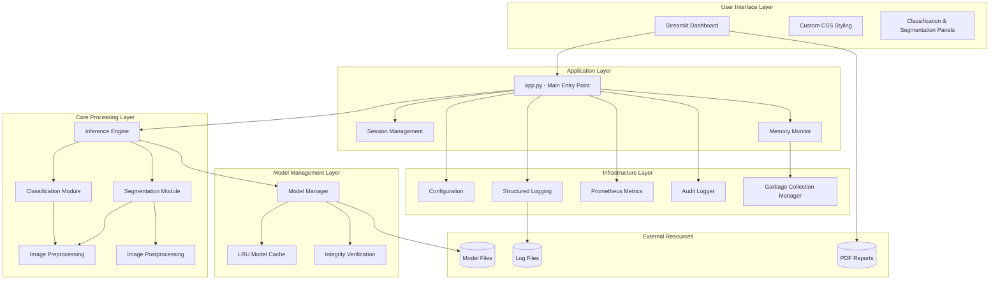
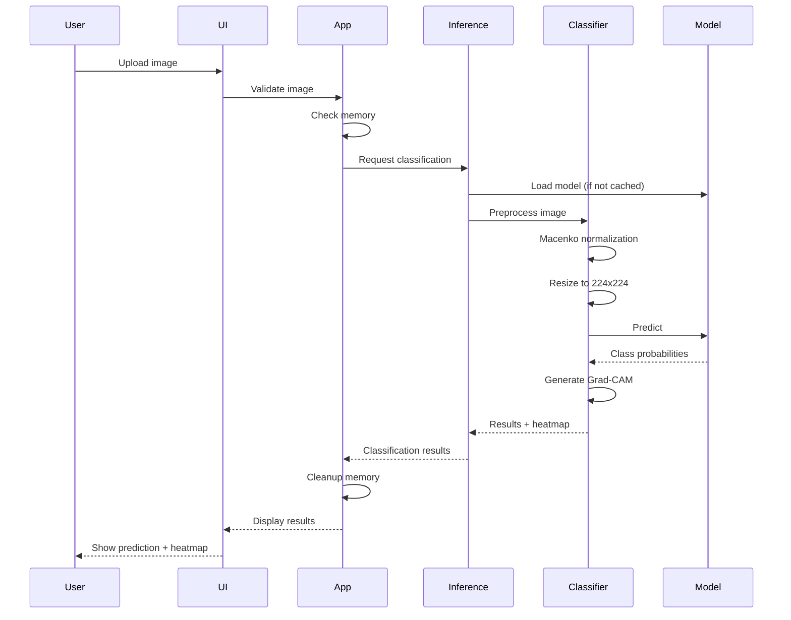
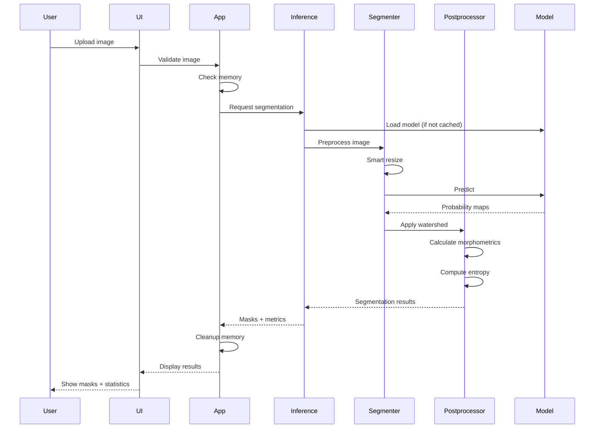

# Architecture Overview

PathoAI is designed as a modular, memory-efficient histopathology analysis system with clear separation of concerns. This document describes the high-level architecture, component interactions, and design decisions.

## System Architecture

## Component Breakdown

### 1. User Interface Layer

**Purpose**: Provides an intuitive web interface for pathologists to upload images, configure analysis, and review results.

**Components**:
- `ui/dashboard.py`: Streamlit UI components
  - Header and branding
  - Custom CSS styling
  - Classification results panel
  - Segmentation results panel
  - Metric cards and visualizations
  - Disease information lookup

**Key Features**:
- Responsive design with custom CSS
- Real-time progress indicators
- Interactive heatmap overlays
- Downloadable PDF reports
- Cached disease information

### 2. Application Layer

**Purpose**: Orchestrates the analysis workflow, manages user sessions, and monitors system resources.

**Components**:
- `app.py`: Main application entry point
  - Session initialization and timeout checking
  - Image upload and validation
  - Analysis mode selection (classification, segmentation, both)
  - Parallel and sequential analysis execution
  - Error handling and fallback mechanisms
  - Report generation

**Key Features**:
- Session-based state management
- Automatic session cleanup on timeout
- Memory-aware request handling
- Graceful degradation on errors
- Performance timing and metrics

### 3. Core Processing Layer

**Purpose**: Implements the core image analysis algorithms including classification, segmentation, and preprocessing.

**Components**:

**Inference Engine** (`core/inference/engine.py`):
- Manages model loading and caching
- Provides unified interface for classification and segmentation
- Handles TensorFlow session cleanup
- Implements memory-efficient inference

**Classification Module** (`core/inference/classifier.py`):
- EfficientNetV2-S based tissue classification
- Grad-CAM visualization for interpretability
- Confidence score calculation
- Three-class prediction (Benign, Adenocarcinoma, Squamous Cell Carcinoma)

**Segmentation Module** (`core/inference/segmenter.py`):
- CIA-Net based nucleus segmentation
- Probability map generation
- Binary mask creation with thresholding

**Preprocessing** (`core/analysis/preprocessing.py`):
- Image validation (format, size, dimensions)
- Smart resizing with aspect ratio preservation
- Macenko stain normalization
- Memory-mapped file loading for large images

**Postprocessing** (`core/analysis/postprocessing.py`):
- Adaptive watershed segmentation
- Morphometric feature calculation (area, perimeter, circularity)
- Entropy-based uncertainty quantification
- Cell density and spatial distribution analysis

### 4. Model Management Layer

**Purpose**: Handles model loading, caching, and integrity verification.

**Components**:
- `core/models/manager.py`: Model lifecycle management
  - Lazy loading (models load on first use)
  - LRU cache (default: 2 models)
  - SHA256 checksum verification
  - Automatic model download (future feature)

**Key Features**:
- Memory-efficient model caching
- Integrity checks prevent corrupted models
- Thread-safe model access
- Graceful handling of missing models

### 5. Memory Management Layer

**Purpose**: Monitors memory usage, manages sessions, and performs garbage collection to prevent out-of-memory errors.

**Components**:

**Memory Monitor** (`core/memory/monitor.py`):
- Real-time memory usage tracking
- Warning thresholds (default: 85%)
- Emergency cleanup triggers
- Structured logging of memory events

**Session Manager** (`core/memory/session_manager.py`):
- Session data storage and retrieval
- Automatic timeout-based cleanup
- Memory usage estimation per session
- Inactive session detection

**Garbage Collection Manager** (`core/memory/gc_manager.py`):
- Configurable aggressiveness levels (low, moderate, high)
- Generation-based collection strategies
- Collection statistics tracking
- Proactive cleanup on memory pressure

**Memory Configuration** (`core/memory/config.py`):
- Environment-based configuration
- Default value management
- Parameter validation
- Backward compatibility

### 6. Infrastructure Layer

**Purpose**: Provides cross-cutting concerns like configuration, logging, monitoring, and auditing.

**Components**:

**Configuration** (`config/settings.py`):
- Centralized settings management
- Environment variable support
- Security parameters (CORS, file size limits)
- Model paths and checksums
- Logging and Sentry configuration

**Logging**:
- Structured JSON logging (optional)
- Multiple handlers (console, file, error, audit)
- Log rotation (10MB per file, 5 backups)
- PII scrubbing for Sentry events

**Metrics** (`utils/metrics.py`):
- Prometheus metrics export
- Request counting
- Inference duration tracking
- Memory usage monitoring
- Active session tracking
- Model prediction counters

**Audit Logger** (`utils/audit_logger.py`):
- Compliance-focused event logging
- Image upload tracking
- Analysis start/complete events
- Report download tracking
- Separate audit log file

## Data Flow

### Classification Workflow

### Segmentation Workflow

## Design Decisions

### 1. Memory Management Strategy

**Decision**: Implement proactive memory monitoring with automatic cleanup.

**Rationale**:
- Histopathology images can be very large (100+ megapixels)
- Deep learning models consume significant memory (500MB+ per model)
- Streamlit sessions persist in memory
- Out-of-memory errors crash the application

**Implementation**:
- Real-time memory monitoring with configurable thresholds
- Session-based memory tracking and cleanup
- Automatic garbage collection after inference
- LRU cache for models (evict least recently used)
- Memory-mapped file loading for large images

### 2. Modular Architecture

**Decision**: Separate concerns into distinct modules with clear interfaces.

**Rationale**:
- Easier testing and maintenance
- Reusable components
- Clear dependency boundaries
- Facilitates future extensions

**Implementation**:
- Core processing logic independent of UI
- Inference engine abstracts model details
- Memory management as a separate concern
- Configuration centralized in one module

### 3. Lazy Model Loading

**Decision**: Load models on first use rather than at startup.

**Rationale**:
- Faster application startup
- Reduced memory footprint when models not needed
- Supports multiple models without loading all

**Implementation**:
- Models loaded on first inference request
- LRU cache keeps recently used models in memory
- Automatic eviction when cache is full

### 4. Parallel vs Sequential Analysis

**Decision**: Support both parallel and sequential execution modes.

**Rationale**:
- Parallel is faster but uses more memory
- Sequential is safer for memory-constrained environments
- Users can choose based on their needs

**Implementation**:
- Parallel mode uses `concurrent.futures.ThreadPoolExecutor`
- Sequential mode runs classification then segmentation
- Automatic fallback to sequential on parallel failure

### 5. Grad-CAM for Interpretability

**Decision**: Generate Grad-CAM heatmaps for all classifications.

**Rationale**:
- Pathologists need to understand model decisions
- Heatmaps show which regions influenced the prediction
- Builds trust in AI-assisted diagnosis

**Implementation**:
- Activation-based CAM using last convolutional layer
- Heatmap overlay on original image
- Color-coded intensity (red = high importance)

### 6. Macenko Stain Normalization

**Decision**: Apply Macenko normalization to all input images.

**Rationale**:
- Histopathology staining varies between labs
- Normalization improves model consistency
- Reduces domain shift effects

**Implementation**:
- SVD-based stain matrix estimation
- Downsampling for faster computation
- Fallback to original image on failure

### 7. Adaptive Watershed Segmentation

**Decision**: Use adaptive watershed for nucleus separation.

**Rationale**:
- Handles overlapping nuclei better than simple thresholding
- Adapts to local image characteristics
- Produces more accurate cell counts

**Implementation**:
- Distance transform for seed detection
- Marker-based watershed
- Morphological operations for cleanup

### 8. Session-Based State Management

**Decision**: Use Streamlit session state for user data.

**Rationale**:
- Streamlit is stateless by default
- Need to persist uploaded images and results
- Session timeout prevents memory leaks

**Implementation**:
- Session ID generation on first access
- Automatic cleanup after 30 minutes of inactivity
- Memory usage tracking per session

### 9. Prometheus Metrics

**Decision**: Export metrics in Prometheus format.

**Rationale**:
- Industry-standard monitoring solution
- Integrates with Grafana for visualization
- Supports alerting on anomalies

**Implementation**:
- Metrics server on port 9090
- Counters for requests and predictions
- Histograms for inference duration
- Gauges for memory and active sessions

### 10. Docker Deployment

**Decision**: Provide multi-stage Dockerfile for production.

**Rationale**:
- Reproducible deployments
- Isolated environment
- Easy scaling with orchestration
- Security through non-root user

**Implementation**:
- Builder stage for dependency compilation
- Runtime stage with minimal image
- Health checks for container orchestration
- Model integrity validation at build time

## Security Considerations

### Input Validation

- File size limits (50 MB)
- Image dimension limits (100 megapixels)
- Format whitelist (PNG, JPEG, TIFF)
- CORS origin whitelist

### Model Integrity

- SHA256 checksum verification
- Prevents loading corrupted or tampered models
- Checksums stored in configuration

### PII Protection

- Sentry event scrubbing removes patient data
- Audit logs use session IDs, not personal identifiers
- No patient data stored on disk

### Session Security

- Automatic timeout after 30 minutes
- Session data cleanup on expiration
- No cross-session data leakage

## Performance Characteristics

### Inference Times (CPU)

- Classification: 2-5 seconds
- Segmentation: 5-10 seconds
- Both (parallel): 6-12 seconds
- Both (sequential): 7-15 seconds

### Memory Usage

- Base application: ~500 MB
- Classification model: ~200 MB
- Segmentation model: ~150 MB
- Image processing: ~100-500 MB (depends on image size)
- Peak usage: ~1.5 GB

### Scalability

- Single-user: Handles 1-2 concurrent analyses
- Multi-user: Requires load balancing and session affinity
- Horizontal scaling: Stateless design supports multiple instances
- Vertical scaling: Benefits from more RAM and GPU

## Future Enhancements

### Planned Features

1. **Multi-model ensemble**: Combine predictions from multiple models
2. **Batch processing**: Analyze multiple images in one request
3. **ROI selection**: Allow users to select regions of interest
4. **Custom thresholds**: User-configurable segmentation thresholds
5. **Export formats**: Support DICOM, OME-TIFF, and other medical formats
6. **Database integration**: Store analysis history and results
7. **User authentication**: Multi-user support with access control
8. **Model versioning**: Track and compare model versions
9. **Active learning**: Collect feedback for model improvement
10. **GPU optimization**: Optimize for multi-GPU inference

### Technical Debt

1. **Test coverage**: Add comprehensive unit and integration tests
2. **Type hints**: Complete type annotations for all modules
3. **Documentation**: Add inline docstrings for all functions
4. **Error handling**: Improve error messages and recovery
5. **Configuration**: Move hardcoded values to configuration
6. **Logging**: Standardize log levels and messages
7. **Metrics**: Add more granular performance metrics
8. **Security**: Implement rate limiting and authentication

---

*For implementation details, see the [API Reference](api/README.md)*
